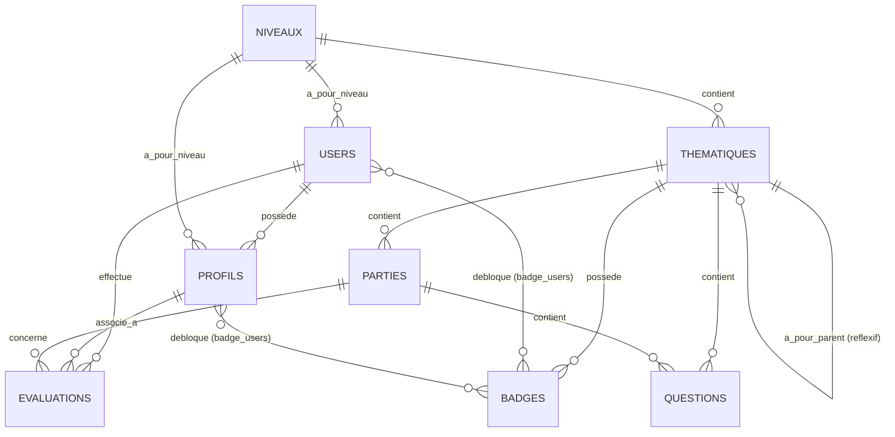

# 🦉 Petit Sage - Backend API (Laravel 12)

Bienvenue sur le dépôt backend de **Petit Sage**, une application éducative gamifiée intégrant des quiz interactifs et des mécaniques ludiques (niveaux, thématiques, parties, badges, et évaluations) pour la transmission de valeurs sociales auprès des jeunes apprenants.

Le backend est développé sous le framework **Laravel 12** avec **PHP 8.2+**.

---

## 🛠️ Stack Technique & Dépendances

*   **Framework Principal :** Laravel `^12.0`
*   **Version PHP :** `^8.2`
*   **Gestionnaire de Base de Données :** MySQL / SQLite
*   **Authentification :** Laravel Sanctum `^4.0` (sessions SPA d'état / Cookies)
*   **Services tiers intégrés :**
    *   **ElevenLabs API :** Synthèse vocale (TTS) avec mise en cache locale des fichiers audio (`ElevenLabsController`).
    *   **Sentry :** Suivi et monitoring des erreurs en temps réel (`sentry-laravel` `^4.22`).
*   **Dépendances non-utilisées / Stubs :**
    *   `google/cloud-text-to-speech` (installé mais non-utilisé dans les controleurs actifs).
    *   `openai-php/client` (installé pour de futures intégrations mais non-utilisé).

---

## 📂 Architecture Générale du Projet

Le projet suit l'architecture standard MVC (Modèle-Vue-Contrôleur) de Laravel, avec quelques adaptations pour un fonctionnement en mode API REST :

```text
app/
├── Http/
│   ├── Controllers/       # Traitement des requêtes HTTP & Réponses API
│   │   ├── AuthController.php        # Authentification utilisateur (Sanctum), Email Verification
│   │   ├── DashboardController.php   # KPI et agrégations statistiques admin
│   │   ├── ElevenLabsController.php  # Synthèse vocale de textes via ElevenLabs
│   │   ├── EvaluationController.php  # Enregistrement des sessions de jeu, scores & dessins
│   │   └── ...
│   └── Middleware/        # Middlewares (EnsureFrontendRequestsAreStateful prépendu pour Sanctum)
├── Models/                # Entités de base de données et relations Eloquent
│   ├── User.php           # Compte principal (Admin, Parent, Apprenti)
│   ├── Profil.php         # Sous-compte joueur/enfant rattaché à un utilisateur
│   ├── Niveau.php         # Niveaux scolaires/d'âge (ex: 3-7 ans, 8-12 ans, etc.)
│   ├── Thematique.php     # Thématiques de jeu (réflexive : Thème Principal et Sous-thèmes)
│   ├── Partie.php         # Chapitre/Séquence au sein d'une thématique
│   ├── Question.php       # Question avec choix multiples/uniques en format JSON
│   ├── Evaluation.php     # Session d'évaluation réalisée (Score, dessin, temps, erreurs)
│   ├── Badge.php          # Badge déblocable selon un score minimum dans une thématique
│   └── badge_users.php    # Modèle Pivot d'attribution des badges aux utilisateurs/profils
├── Services/              # Services métiers découplés
│   ├── AudioManageService.php # Gestion physique et suppression sécurisée des fichiers vocaux
│   └── MailService.php        # Service d'envoi d'emails asynchrones (via Queue)
```

---

## 🗄️ Structure & Relations de Base de Données

Le schéma de base de données est structuré pour gérer l'arborescence du jeu et la progression individuelle :



### Description des Modèles Principaux :
*   **User (Utilisateur) :** Compte parent/administrateur. Rattaché à un type (Apprenti, Parent, Admin).
*   **Profil (Profil Joueur) :** Sous-compte pour enfant, permettant à plusieurs joueurs de progresser de manière isolée sur un même appareil.
*   **Niveau :** Tranches d'âges associées aux thématiques de jeu (ex : Niveau 1 pour 3 à 7 ans).
*   **Thematique :** Sujets généraux divisés en sous-thématiques (ex : Solidarité, Respect).
*   **Partie :** Série ordonnée de questions associée à un sous-thème.
*   **Question :** Structure flexible contenant l'énoncé (texte, URL média) et un champ JSON `reponses` contenant les choix avec leur statut d'exactitude.
*   **Evaluation :** Historique des sessions de quiz. Contient le score final, le temps passé, les données de canvas de dessin sauvegardées sous format PNG/JPG, et la liste des questions échouées.
*   **Badge :** Récompense débloquée pour un profil ou utilisateur lorsque son score cumulatif sur une thématique atteint le seuil requis (`nbr_min_point`).

---

## ⚡ Installation et Lancement Local

Suivez ces étapes pour installer et exécuter l'environnement de développement :

### 1. Prérequis
*   PHP `>= 8.2`
*   Composer
*   NodeJS & NPM
*   Serveur MySQL ou base SQLite

### 2. Cloner et installer les dépendances
```bash
composer install
npm install
```

### 3. Configurer l'environnement
Copiez le fichier d'exemple et générez la clé de sécurité de l'application :
```bash
cp .env.example .env
php artisan key:generate
```
Éditez ensuite le fichier `.env` pour y renseigner vos identifiants de base de données et vos clés d'API (ElevenLabs, Sentry, SMTP Mail).

### 4. Migrer et initialiser la base de données
Vous pouvez exécuter les migrations et injecter les données de démonstration via :
```bash
php artisan migrate --seed
```
*Note : Un fichier dump SQL complet est également disponible à la racine sous le nom `ludophylosophie.sql` pour un import direct si nécessaire.*

### 5. Configurer le stockage local
Pour rendre les images de dessins et les fichiers audio synthétisés accessibles par le front-end, créez le lien symbolique du dossier public :
```bash
php artisan storage:link
```

### 6. Lancer le serveur de développement
Vous pouvez utiliser la commande Composer personnalisée définie dans `composer.json` pour lancer simultanément le serveur de développement, l'écouteur de file d'attente (pour l'envoi d'emails) et le bundle de ressources :
```bash
composer dev
```
*Cette commande exécute sous le capot `php artisan serve`, `php artisan queue:listen --tries=1` et `npm run dev`.*

---

## ⚠️ Anomalies & Points d'Attention Identifiés

Pendant l'analyse de la codebase, plusieurs dysfonctionnements et opportunités d'amélioration ont été détectés :

1.  **`TTSController` manquant (Erreur Critique Route) :**
    Le fichier `routes/api.php` importe et appelle `TTSController` à la ligne 29 (`Route::post('/tts', [TTSController::class, 'generate']);`). Cependant, aucun fichier `TTSController.php` n'existe dans `app/Http/Controllers/`. Appeler cette route provoquera une erreur fatale. Si vous utilisez uniquement ElevenLabs, cette route doit être retirée ou le contrôleur doit être créé pour supporter Google TTS.
2.  **Bug de validation dans `ContactController@store` :**
    À la ligne 41 de `ContactController.php`, le code vérifie la validation via `if ($request->fails())`. Cependant, `$request` est une instance de `Request` de Laravel et ne possède pas la méthode `fails()`. Cela génère une exception `BadMethodCallException` lors de l'enregistrement réussi de formulaires de contact. La validation native de Laravel lègue déjà cette gestion via des exceptions automatisées, ce bloc `if` doit donc être supprimé ou corrigé avec un validateur séparé.
3.  **Bouchon de débogage dans `EvaluationController@getEvalUser` :**
    La méthode `getEvalUser()` à la ligne 243 de `EvaluationController.php` commence directement par `return true;`, empêchant toute sélection et renvoi de données réelles d'évaluation d'un compte ou d'un profil. Le code de récupération SQL est ainsi désactivé.
4.  **Nom de classe non-standard `badge_users` :**
    La classe de modèle associée à la table pivot s'appelle `badge_users.php` et utilise un nom de classe en minuscules et snake_case. Il est recommandé de la renommer en `BadgeUser` (PascalCase) selon les conventions PSR-12 et standards de Laravel.
5.  **Importation manquante dans `badge_users.php` :**
    À la ligne 28 de `app/Models/badge_users.php`, le type de retour de la relation `profil()` est défini sur `: BelongsTo`, mais l'import de la classe `use Illuminate\Database\Eloquent\Relations\BelongsTo;` est absent en haut du fichier, ce qui lèvera une erreur d'interprétation lors de son appel.
6.  **Dépendances inactives :**
    Les librairies `openai-php/client` et `google/cloud-text-to-speech` sont installées via `composer.json` mais ne sont importées nulle part dans la logique active de l'application.
