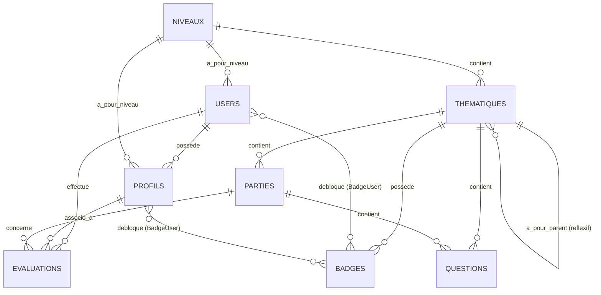

# 🦉 Petit Sage - Backend API (Laravel 12)

Bienvenue sur le dépôt backend de **Petit Sage**, une application éducative gamifiée intégrant des quiz interactifs et des mécaniques ludiques (niveaux, thématiques, parties, badges, et évaluations) pour la transmission de valeurs sociales auprès des jeunes apprenants.

Le backend est développé sous le framework **Laravel 12** avec **PHP 8.2+**.

---

## 🛠️ Stack Technique & Dépendances

*   **Framework Principal :** Laravel `^12.0`
*   **Version PHP :** `^8.2`
*   **Gestionnaire de Base de Données :** MySQL / SQLite
*   **Authentification :** Laravel Sanctum `^4.0` (sessions SPA d'état / Cookies / Tokens)
*   **Système d'Audit Log :** Spatie Laravel Activitylog `^5.0`
*   **Services tiers intégrés :**
    *   **ElevenLabs API :** Synthèse vocale (TTS) avec mise en cache locale des fichiers audio (`ElevenLabsController`).
    *   **Sentry :** Suivi et monitoring des erreurs en temps réel (`sentry-laravel` `^4.22`).

---

## 📂 Architecture Générale du Projet

Le projet suit une architecture MVC découplée et optimisée pour une API REST :

```text
app/
├── Http/
│   ├── Controllers/       # Contrôleurs HTTP standards (allégés de la logique métier)
│   │   ├── AuthController.php        # Authentification utilisateur (Sanctum)
│   │   ├── ActivityLogController.php # API d'administration et consultation des logs d'activité
│   │   ├── DashboardController.php   # KPI et statistiques d'administration
│   │   ├── ElevenLabsController.php  # Synthèse vocale de textes via ElevenLabs
│   │   ├── EvaluationController.php  # Sessions de jeu, scores & dessins
│   │   ├── ResponseHelper.php        # Centralisation des retours JSON formatés
│   │   └── ...
│   ├── Middleware/        # Middlewares globaux (CORS, Sanctum, etc.)
│   └── Requests/          # Validation de formulaires découplée (Form Requests)
│       ├── LoginRequest.php
│       ├── RegisterRequest.php
│       └── ...
├── Models/                # Modèles Eloquent & relations
│   ├── User.php           # Compte principal (Admin, Parent, Apprenti)
│   ├── Profil.php         # Sous-compte joueur/enfant rattaché à un utilisateur
│   ├── Niveau.php         # Niveaux scolaires/d'âge (ex: 3-7 ans, 8-12 ans, etc.)
│   ├── Thematique.php     # Thématiques de jeu (structure réflexive)
│   ├── Partie.php         # Chapitre/Séquence au sein d'une thématique
│   ├── Question.php       # Question avec choix multiples/uniques en format JSON
│   ├── Evaluation.php     # Session d'évaluation réalisée (Score, dessin, temps, erreurs)
│   ├── Badge.php          # Badge déblocable selon un score minimum
│   ├── Setting.php        # Paramètres généraux de la plateforme (singleton)
│   └── BadgeUser.php      # Modèle Pivot personnalisé d'attribution des badges
├── Services/              # Services métiers découplés
│   ├── AudioManageService.php # Gestion physique et suppression sécurisée des fichiers vocaux
│   ├── MailService.php        # Service d'envoi d'emails asynchrones (via Queue)
```

---

## 🗄️ Structure & Relations de Base de Données

Le schéma de base de données est structuré pour gérer l'arborescence du jeu et la progression individuelle :



---

## 👁️ Système de Journalisation d'Activité (Audit Log)

L'application intègre un **"œil de dieu"** robuste basé sur `spatie/laravel-activitylog` :
*   **Modèles suivis :** Les créations, modifications et suppressions sur `User`, `Question`, `Badge`, `Evaluation`, `Partie`, `Setting` et `Profil` sont enregistrées automatiquement en détectant les champs modifiés (`logOnlyDirty()`).
*   **Authentification :** Les événements de connexion réussie (`login`), de déconnexion (`logout`) et d'échecs de connexion (`login_failed`) sont tracés avec l'adresse IP et le User-Agent de la requête.
*   **Conservation :** Les logs d'activités obsolètes sont purgés automatiquement après **90 jours** (`clean_after_days => 90`).
*   **Récupération API (Frontend) :**
    *   `GET /api/admin/activity-logs` : Réservé aux administrateurs. Permet de filtrer par utilisateur, modèle, IP, action, et plage de dates.
    *   `GET /api/activity-logs/me` : Accessible par l'utilisateur connecté pour consulter son propre historique d'activité (filtrable par profil enfant ou action).

---

## 🌐 Traduction et Gestion des Erreurs

*   **Langue par défaut :** Le français (`fr`) est configuré par défaut dans le fichier `.env` (`APP_LOCALE=fr`).
*   **Traductions de formulaires :** Le dossier `lang/fr/validation.php` contient les traductions exhaustives et personnalisées de l'ensemble des règles de validation et des attributs de formulaires (ex : `sexe` traduit par `genre`, `name` par `nom`, etc.).
*   **Format d'erreur épuré :** Les contrôleurs utilisent `$validator->errors()->first()` au lieu du MessageBag brut pour renvoyer des phrases d'erreurs claires et localisées au frontend au lieu de structures JSON techniques.

---

## ⚡ Installation et Lancement Local

### 1. Prérequis
*   PHP `>= 8.2`
*   Composer
*   NodeJS & NPM
*   Serveur MySQL ou base SQLite

### 2. Cloner et installer les dépendances
```bash
composer install
npm install
```

### 3. Configurer l'environnement
Copiez le fichier d'exemple et générez la clé de sécurité de l'application :
```bash
cp .env.example .env
php artisan key:generate
```
Éditez le fichier `.env` pour y renseigner vos identifiants de base de données et vos clés d'API (ElevenLabs, Sentry, SMTP Mail).

### 4. Migrer et initialiser la base de données
Vous pouvez exécuter les migrations et injecter les données de démonstration via :
```bash
php artisan migrate --seed
```

### 5. Configurer le stockage local
Pour rendre les images de dessins et les fichiers audio synthétisés accessibles par le front-end, créez le lien symbolique du dossier public :
```bash
php artisan storage:link
```

### 6. Lancer le serveur de développement
Lancer simultanément le serveur local, le worker de file d'attente (pour l'envoi d'emails) et le bundle de ressources :
```bash
composer dev
```
*Cette commande personnalisée exécute sous le capot `php artisan serve`, `php artisan queue:listen --tries=1` et `npm run dev`.*

---

## 🧪 Tests Automatisés

L'application comprend une suite complète de tests de fonctionnalités (Feature Tests) couvrant :
*   L'authentification et l'inscription à double facteur (2FA par code mail).
*   La journalisation automatique d'audit (CRUD modèles et événements d'authentification).
*   Les restrictions de sécurité de l'API.

Pour exécuter les tests :
```bash
php artisan test
```

---

## 🛠️ Optimisations et Refactorisations Réalisées

1.  **Allègement des Contrôleurs :** Déplacement de la logique de validation dans `app/Http/Requests` et de la logique métier dans des classes services (ex : `AudioManageService`, `MailService`).
2.  **Harmonisation des Réponses :** Intégration de la classe `ResponseHelper` (anciennement `PackageController`) pour formater de façon homogène toutes les réponses JSON de l'API.
3.  **Performances SQL (Eager Loading) :** Remplacement systématique de `.get()` par `.paginate(15)` sur les listings d'administration majeurs, et implémentation de l'eager-loading natif (`with()`) pour éradiquer les requêtes N+1 (ex : `UserController@show`).
4.  **Élimination des Double Sauvegardes :** Suppression des appels redondants à `$user->save()` présents dans le cycle de vie de création des utilisateurs.
5.  **Standardisation du modèle pivot `BadgeUser` :** Renommé depuis `badge_users` en `BadgeUser` (PascalCase), configuré pour hériter de `Pivot` et associé explicitement aux relations Many-to-Many via `->using()`.
6.  **Sécurisation Session tests :** Ajout de vérifications `hasSession()` dans `AuthController` pour permettre l'exécution fluide des tests d'API sans état de session.
